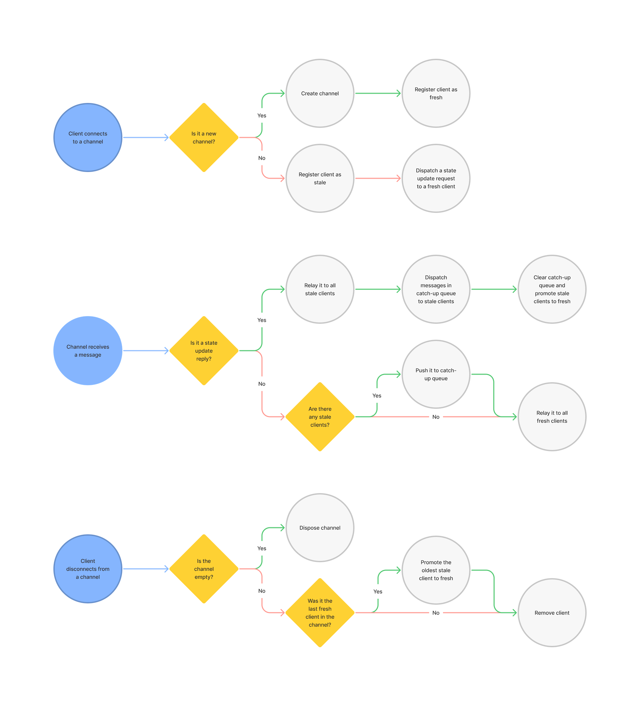

# Hummingbird

> Action broadcaster for easy multiplayer web applications.

## About

Hummingbird is both an **open-source software** and a **public live service** that allows web applications based on action dispatching to relay actions to other connected clients.

## Protocol

Hummingbird uses [WebSocket](https://developer.mozilla.org/en-US/docs/Web/API/WebSocket) to exchange messages between client and server. When the upgrade request is made, the pathname (e.g. `/my/channel` in `wws://hummingbird.crz.li/my/channel`) is used as channel and incoming messages are relayed to other clients connected on the same channel, like a broadcasting system, but it has a few extra steps to make state synchronization easier. Clients are flagged as either fresh or stale. Fresh clients are free to exchange messages but stale clients will require a _state update_ from a fresh client before receiving any other messages. Also, all exchanged messages are expected to be JSON encoded objects with a `type` field.



It's important to notice that there are limitations with this approach. See [pitfalls](#pitfalls) below.

## Usage

No setup is required and the service is free. Simply open a new connection and you're good to go.

```typescript
const webSocket = new WebSocket("wws://hummingbird.crz.li/test");
webSocket.send(JSON.stringify({ type: "someAction" }));
```

Below is a contrived example using React, with important parts commented. You can also [see the full code](https://codesandbox.io/s/hummingbird-demo-cg8z8?file=/src/App.tsx).

```typescript
function reducer(state: number, action: Action) {
  switch (action.type) {
    // When we receive a state update we need to do some state reconciliation, since it could have changed between request and reply.
    case "stateUpdateReply":
      return state + action.payload;
    case "+1":
      return state + 1;
    default:
      return state;
  }
}

export default function App() {
  const [count, dispatch] = useReducer(reducer, 0);

  const [readyState, broadcast] = useWebSocket({
    onMessage(action) {
      // We must respond a state update request with our current state.
      if (action.type === "stateUpdateRequest") {
        broadcast({ type: "stateUpdateReply", payload: count });
      }
      dispatch(action);
    },
  });

  const handleClick = () => {
    const action = { type: "+1" } as Action;

    // When we click the button we need to:
    // 1. Dispatch the action to update our own state.
    dispatch(action);
    // 2. Relay the action to ther connected clients.
    broadcast(action);
  };

  if (readyState !== WebSocket.OPEN) {
    return <p>Connecting...</p>;
  }

  return (
    <div>
      <p>Count: {count}</p>
      <button onClick={handleClick}>Add 1</button>
    </div>
  );
}
```

[See it in action](https://cg8z8.csb.app/). Open in two different tabs and check them out side by side.

### Pitfalls

- Actions dispatched by a stale client will be relayed to other fresh clients even before a state reconciliation has happened.
- The client is responsible for state reconciliation upon getting a state update.
- State updates are client authoritative, i.e. there's no security.

## Legal

### Terms of use

By using the service you agree that you will behave lawfully good.

### License

Apache-2.0 © 2022 Arthur Corenzan.
